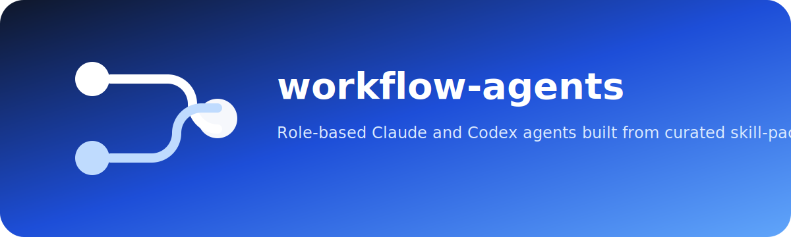

# workflow-agents

<p align="center">
  
</p>

<p align="center">
  
</p>

<p align="center">
  <a href="LICENSE"></a>
  
  
</p>

A workflow-oriented agent layer built on top of the skill-pack repositories. It ships role-based Claude and Codex agents with curated loadouts rather than one agent per pack.

## Included agents

- `requirements-analyst`
- `requirements-analyst-beads`
- `ux-researcher`
- `system-modeler`
- `system-modeler-beads`
- `software-architect`
- `software-architect-beads`
- `web-engineer`
- `backend-engineer`
- `test-designer`
- `test-designer-beads`
- `qa-automation-engineer`
- `quality-reviewer`
- `security-reviewer`
- `security-reviewer-beads`
- `pentest-reviewer`
- `delivery-manager`
- `delivery-manager-beads`
- `research-writer`

## Structure

```text
.claude/agents/*.md               Claude subagents with preloaded skill lists
.codex/agents/*.toml              Codex custom agent profiles
docs/agent-loadouts.md            Curated skill mapping per agent
scripts/render_codex_agents.py    Renders Codex agents with local skills.config paths
install.sh / install.ps1          Installs Claude agents and renders Codex agents
uninstall.sh / uninstall.ps1      Removes installed agent files
AGENTS.md                         Root guidance for the agent layer
```

## Install

```bash
git clone https://github.com/45ck/workflow-agents.git
cd workflow-agents
bash install.sh
```

On Windows:

```powershell
git clone https://github.com/45ck/workflow-agents.git
cd workflow-agents
.\install.ps1
```

The installer is dependency-aware:

- it clones or updates the required skill-pack repos into `~/.workflow-agents/packs/`
- it syncs their packaged skills into `~/.claude/skills/` and `~/.agents/skills/`
- it normalizes installed `SKILL.md` files to include Codex-compatible `name` and `description` frontmatter when upstream packs are missing it
- it installs the Claude agents
- it renders the Codex agents with machine-specific `[[skills.config]]` paths
- it validates that the required skills are present after install

## Dependencies

- Agent definitions live in this repo.
- Skill dependencies live in [scripts/dependencies.json](scripts/dependencies.json).
- Required packs are bootstrapped by [scripts/bootstrap_dependencies.py](scripts/bootstrap_dependencies.py).
- Skill schema normalization is handled by [scripts/normalize_skills.py](scripts/normalize_skills.py).
- Dependency validation is handled by [scripts/check_dependencies.py](scripts/check_dependencies.py).

## Design

- Packs are the source library.
- Agents are thin workflow workers with curated loadouts.
- Claude agents preload only a tight skill list because those skills are injected into context at startup.
- Codex agents stay role-scoped and can be rendered with explicit `skills.config` entries for local installations.
- Beads variants keep the same core loadout but change the output contract toward trackable work items when `bd` is available.

## Placement

The current recommendation is:

- keep shared workflow agents in this central repo
- keep reusable skills in the individual pack repos
- avoid duplicating the full shared roster into every pack repo

Details: [docs/repo-placement.md](docs/repo-placement.md)

## Loadout map

See [docs/agent-loadouts.md](docs/agent-loadouts.md).

## License

[MIT](LICENSE)
